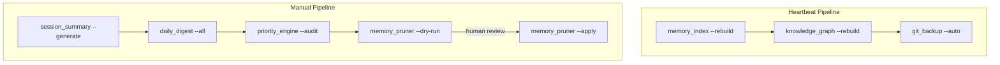

# Memory Scripts Integration Plan

*Generated 2026-05-28*

## Audit Summary

| # | Script | Purpose | Syntax | Dependencies | Status |
|---|--------|---------|--------|-------------|--------|
| 1 | `daily_digest.py` | Categorized daily digest generator | ✅ OK | none | standalone |
| 2 | `priority_engine.py` | P0–P3 priority classification | ✅ OK | none | standalone |
| 3 | `memory_pruner.py` | Smart dedup & archive pruning | ✅ OK | mirrors priority_engine keywords | standalone |
| 4 | `knowledge_graph.py` | Entity-relationship graph | ✅ OK | none | needs integration |
| 5 | `memory_index.py` | Topic-to-file mapping index | ✅ OK | none | needs integration |
| 6 | `session_summary.py` | Session log summarizer | ✅ OK | none | standalone |
| 7 | `git_backup.py` | Git auto-backup | ✅ OK | git CLI | needs integration |

---

## Script: `daily_digest.py` — Daily Digest Generator

- **Purpose:** Reads daily log markdown files (`memory/YYYY-MM-DD.md`), splits them into sections by `##` headings, classifies each section into 6 categories (💼 Business, 💡 Decisions, 🎯 Pending, 🛠️ Kora Upgrade, 🛠️ Tech, 📝 Notes) using keyword matching, and writes formatted digest markdown to `memory/digests/YYYY-MM-DD-digest.md`.
- **Syntax:** ✅ OK
- **Dependency:** None (stdlib only: os, json, sys, re, datetime)
- **CLI:** `--today`, `--date YYYY-MM-DD`, `--all`, `--send`
- **Status:** **standalone** — Ready to use on demand during heartbeats or manual runs.

---

## Script: `priority_engine.py` — Priority Classification Engine

- **Purpose:** Classifies memory entries by P0/P1/P2/P3 priority tiers using regex keyword matching. P0 (Critical: API keys, passwords, boss rules — never delete), P1 (Important: decisions, architecture, deploy — 30-day retention), P2 (Normal: completed, updated, daily — 7-day retention), P3 (Transient: debug, test, wip — 24h retention). Scans MEMORY.md + daily logs.
- **Syntax:** ✅ OK
- **Dependency:** None (stdlib only: os, sys, re, json, pathlib)
- **CLI:** `--classify "<text>"`, `--audit`, `--audit-file <path>`
- **Status:** **standalone** — Useful for periodic audits. Its keyword set is mirrored in `memory_pruner.py` (not imported, duplicated — minor DRY concern but keeps each script self-contained).

---

## Script: `memory_pruner.py` — Smart Dedup & Pruning

- **Purpose:** Scans MEMORY.md for exact duplicate lines, similar lines (>80% Jaccard word overlap), and archivable P2/P3 entries. Deduplicates and prunes to keep MEMORY.md lean. Archived content goes to `memory/ARCHIVE.md` with timestamps.
- **Syntax:** ✅ OK
- **Dependency:** None (stdlib only). **Mirrors** priority_engine's keyword lists internally (copied, not imported) — works standalone.
- **CLI:** `--dry-run` (default), `--apply`, `--status`, `--target-size <KB>`
- **Status:** **manual-only** — This is a destructive operation (modifies MEMORY.md). Should never run automatically during heartbeat. Always use `--dry-run` first to review. Run manually when MEMORY.md exceeds target size.

---

## Script: `knowledge_graph.py` — Entity-Relationship Graph

- **Purpose:** Defines ~50 entities across 4 types (person, project, technology, concept) with alias lists. Scans all memory files + root MEMORY.md/TOOLS.md/AGENTS.md to discover entity mentions. Infers relationships (owns, uses, depends_on, implements, related_to) based on co-occurrence within same section/line/file. Outputs `memory/knowledge-graph.json`.
- **Syntax:** ✅ OK
- **Dependency:** None (stdlib only: os, json, sys, re, datetime)
- **CLI:** (no args → quick status), `--rebuild`, `--stats`, `--query <entity>`, `--graph`
- **Status:** **needs integration** — Rebuild should run during heartbeats to keep graph current. 

**Known issues:**
- Hardcoded WORKSPACE = `/root/.openclaw/workspace` (line ~22). Should use `os.path.dirname(os.path.dirname(__file__))` for portability. This will fail on the current system where workspace is `/home/node/.openclaw/workspace`.
- Large entity definition table (~250 lines of config) — maintenance burden if aliases change.

---

## Script: `memory_index.py` — Topic-to-File Mapping

- **Purpose:** Scans `.md` and `.json` files in `memory/` plus root `MEMORY.md`. Extracts topics from `##` headings, `###` subheadings, and `**bold**` markers. Produces `memory/memory-index.json` with file references and context snippets for each topic.
- **Syntax:** ✅ OK
- **Dependency:** None (stdlib only: json, os, re, sys, datetime)
- **CLI:** (no args → quick status), `--rebuild`, `--search <topic>`, `--stats`
- **Status:** **needs integration** — Rebuild should run during heartbeats. Works as a lightweight complement to knowledge_graph (topic search vs. entity relationships).

---

## Script: `session_summary.py` — Session Summarizer

- **Purpose:** Reads a session/daily log, categorizes lines into ✅ Completed, ❌ Pending, 💡 Key Decisions, 📝 Notes. Can write summary back to daily log (`--generate`) and update MEMORY.md with key decisions (`--update-memory`).
- **Syntax:** ✅ OK
- **Dependency:** None (stdlib only: os, sys, json, re, datetime)
- **CLI:** `--dry-run` (default), `--generate`, `--update-memory`, `--session YYYY-MM-DD`
- **Status:** **standalone** — Simpler categorization than daily_digest. Overlap in purpose — daily_digest is more sophisticated (6 categories vs 4, section-based parsing vs line-based). Keep both; session_summary for end-of-session wrap-up, daily_digest for batch digest generation.

---

## Script: `git_backup.py` — Git Auto-Backup

- **Purpose:** Manages a git repo inside `memory/`. Initialize repo, auto-commit all changes with timestamp messages, show status/log. Creates `.gitignore` for temp files.
- **Syntax:** ✅ OK
- **Dependency:** Requires `git` CLI installed on the system.
- **CLI:** `--init`, `--commit "msg"`, `--auto`, `--status`, `--log [N]`
- **Status:** **needs integration** — Should run `--auto` at the end of every heartbeat cycle to commit any changes from index/rebuild steps. Should run `--init` once during setup.

---

## Integration Strategy

### Heartbeat Pipeline (runs periodically)

These scripts are lightweight/idempotent and safe for unattended execution:

```
1. memory_index --rebuild         (fast, ~1-2s, rebuild topic map)
2. knowledge_graph --rebuild      (medium, ~3-5s, rebuild entity graph)
3. git_backup --auto              (final step, commit all changes)
```

**Rationale:**
- `memory_index` goes first because it's the fastest and catches all newly written files.
- `knowledge_graph` goes second — depends on files being present but doesn't depend on index.
- `git_backup --auto` runs last to commit everything (including index.json and knowledge-graph.json produced by steps 1-2).
- `git_backup --auto` also handles `--init` internally if the repo doesn't exist yet.

### On-Demand Pipeline (manual trigger only)

```
1. session_summary --generate --session YYYY-MM-DD   (after a session ends)
2. daily_digest --all                                  (batch digest generation)
3. priority_engine --audit                             (review priority tiers)
4. memory_pruner --dry-run                             (always preview first!)
5. memory_pruner --apply                               (only after reviewing dry-run)
```

**Rationale:**
- `session_summary` is session-tied — the user triggers it after a conversation.
- `daily_digest --all` generates all digests at once, useful after several days of logs.
- `priority_engine --audit` is insightful but not urgent — run weekly or when curious.
- `memory_pruner` is **never automatic** — it modifies MEMORY.md destructively. Always requires human review via `--dry-run` first.

### Scripts to Keep but Never Auto-Run

| Script | Reason |
|--------|--------|
| `memory_pruner.py --apply` | Destructive — modifies MEMORY.md |
| `memory_pruner.py --dry-run` | Safe but noisy for heartbeat |
| `daily_digest.py --send` | Prints Telegram-ready markdown — output-only |
| `session_summary.py --generate` | Requires session context; not schedulable |
| `priority_engine.py --audit` | Heavy scan, not time-sensitive |

### Scripts to Discard / Consider Deprecating

*None at this time.* All 7 scripts serve distinct purposes. However, note overlap between `session_summary.py` and `daily_digest.py` categorization logic — they could be unified in a future refactor.

### Execution Order Summary



### Known Bugs Found During Audit

1. **`knowledge_graph.py` — Hardcoded WORKSPACE path:**
   ```python
   WORKSPACE = '/root/.openclaw/workspace'  # line ~22
   ```
   Should be:
   ```python
   WORKSPACE = os.path.dirname(os.path.dirname(os.path.abspath(__file__)))
   ```
   The hardcoded path will fail on the current system (`/home/node/.openclaw/workspace`). The maintenance script handles this by passing the correct paths explicitly, but the script itself won't run standalone without fixing.

2. **`memory_pruner.py` — Duplicated keyword lists:** The P0-P3 keyword regex patterns are copied from `priority_engine.py` rather than imported. This works standalone but means updates must be made in two places.

3. **`session_summary.py` — MEMORY.md path is wrong:**
   ```python
   MEMORY_FILE = os.path.join(MEMORY_DIR, 'MEMORY.md')
   ```
   This resolves to `memory/MEMORY.md` but the actual file is at workspace root (`MEMORY.md`). The `--update-memory` flag writes to the wrong location.
